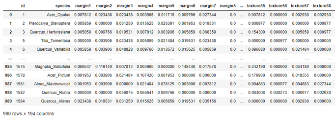

# Leaf-Classification
use Neural network to classify leaf.

1. Data description: \
The dataset consists approximately 990 leaf specimens/images, and its features. Three sets of features are also provided per row or image: a shape contiguous descriptor, an interior texture histogram, and a fine-scale margin histogram. For each feature, a 64-attribute vector is given per leaf sample.
We have in total 99 classes, and 192 features.\
the dataset: https://www.kaggle.com/c/leaf-classification/data
2. data cleaning  \
I have tried removing missing values, and duplicate rows, but no missing values or duplicates 
3. Data visualization:\
 
5. Draw some of the images 
 
 
correlation analysis:\
 
 
no much correlation between certain column and the other columns

training a neural network:\
I will implement 3-layer MLP model (one input layer, one hidden layer with tanh activation and one output layer).
First: I have divided the data into training set, validation set, and testing set.
Second: make normalization.
Third: I tunned the hyperparameters on validation set, I have tunned batch size, no. of epochs, model dropout rate, no. of nodes at hidden layer, optimizer, optimizer learning rate.
 

Forth: Evaluate on the test set.
 
 

